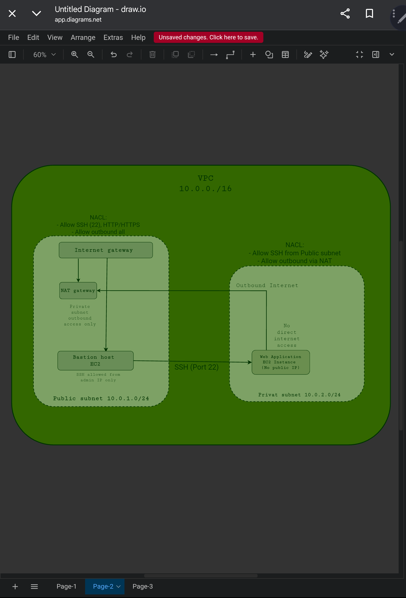
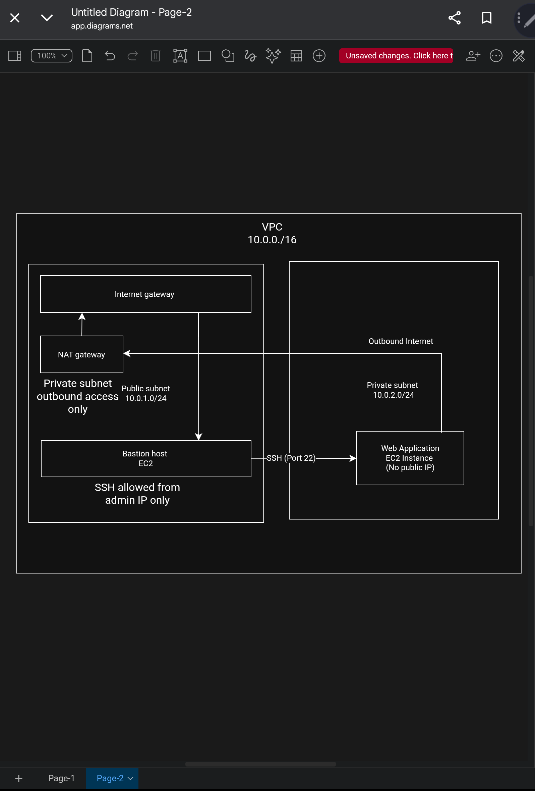

# P2-VPC_Architecture-
Secure VPC architecture with public private subnets

##Objectives
Design a secure VPC Architecture using aws networking best practices.

## Architecture Overview
This project demonstrates a VPC with public and private subnets.
The web application is deployed in a private subnet and accessed securely.

## Components Used
- Virtual Private Cloud (VPC)
- Public Subnet
- Private Subnet
- Internet Gateway
- NAT Gateway
- Bastion Host
- Security Groups
- Network ACLs

## Security Design
- Public subnet allows limited internet access
- Private subnet has no direct internet access
- Bastion Host is used for secure SSH access
- Security Groups and NACLs control inbound and outbound traffic

## Architecture Diagram

## Tools used 
draw.io(diagrams.net) for architecture design
